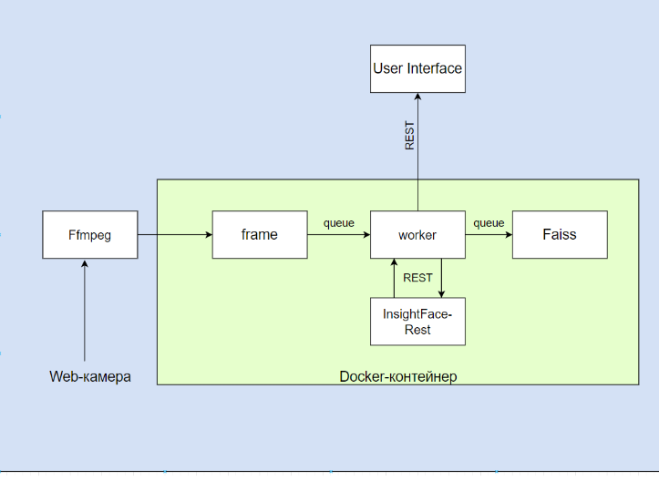

# Программный комплекс детектирования лиц в реальном времени (Задание на производственную практику)

## Задание для реализации
### Комплекс производит обработку входящего видеопотока с помощью InsightFace-REST, выделяя лица прямоугольной рамкой, извлекает и сохраняет их уникальные вектора в базу данных. Лицо с рамкой выводится в пользовательский интерфейс.

## Описание сервисов

- **Сервис 1 - Ffmpeg**
  - **Описание**
  Отвечает за захват видеопотока с вебкамеры компьютера/ноутбука
  - **Use cases**
  Захват видеопотока в реальном времени
  - **Требования**
  Способность захватывать видеопоток с web-камеры

- **Сервис 2 - frame**
  - **Описание**
  Отвечает за раскадровку видеопотока
  - **Use cases**
    Получение видеопотока 
    Раскадровка видеопотока (1 кадр в секунду)
    Передача изображений в промежуточный сервис worker
  - **Требования**
    Обеспечение непрерывной обработки видеопотока
    Передача изображений в worker

- **Сервис 3 - worker**
  - **Описание**
  Промежуточный сервис, обеспечивающий взаимодействие ключевых сервисов
  - **Use cases**
    Получение изображений от сервиса Frame
    Передача изображений в сервис InsightFace-REST
    Получение векторов лиц и отправка их в сервис Faiss
    Передача обработанных изображений и информации о лицах (координаты рамок векторы) из сервиса InsightFace-REST в User Interface
  - **Требования**
    Надежная интеграция с сервисами frame, Faiss, InsightFace-REST и User Interface
    Эффективная обработка изображений в параллельном режиме для обеспечения высокой производительности

- **Сервис 4 - InsightFace-REST**
  - **Описание**
  Отвечает за детектирование и выделение лиц на изображениях, полученных от сервиса worker
  - **Use cases**
    Получение изображений от сервиса worker
    Обнаружение лиц на изображении
    Выделение лиц рамками
    Передача информации о лицах (векторы, координаты рамок) и обработанного изображения в сервис worker
  - **Требования**
    Высокая точность при обнаружении лиц
    Обработка изображений в параллельном режиме

- **Сервис 5 - Faiss**
  - **Описание**
  Отвечает за хранение уникальных векторов лиц
  - **Use cases**
    Получение векторов лиц от сервиса worker
    Проверка вектора на уникальность
    Добавление вектора в базу данных Faiss
  - **Требования**
    Обеспечение надежного хранения и целостности данных

- **Сервис 6 - User Interface**
  - **Описание**
  Отвечает за отображение результатов обработки видеопотока: изображения с лицом, выделенным рамкой, координат рамки, уникального вектора
  - **Use cases**
    Отображение видеопотока, где лица выделены рамками
    Вывод данных о каждом лице ( вектор и координаты рамки)
  - **Требования**
    Минимально возможная задержка передачи видеопотока